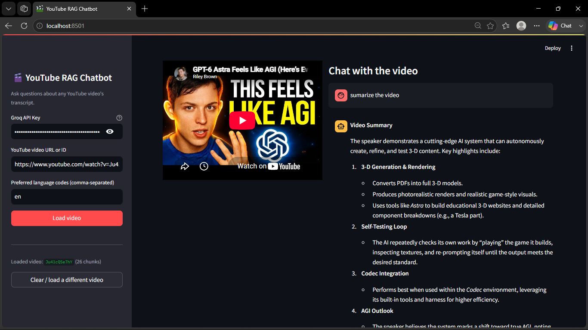
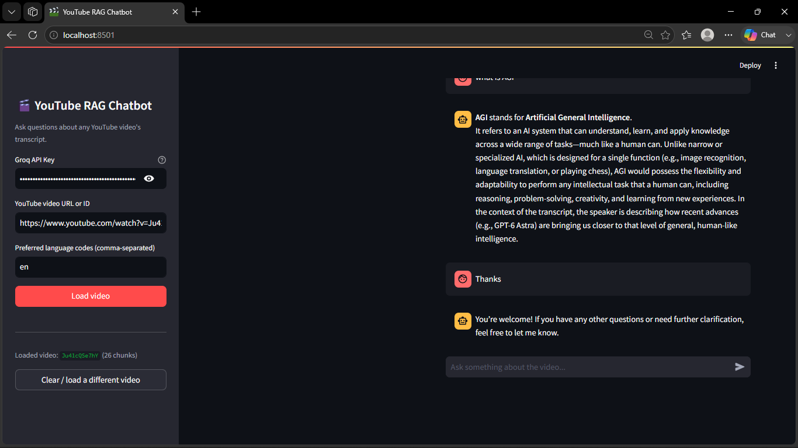

# 🎥 RAG-Based YouTube Chatbot

A Python + Generative AI powered chatbot that answers questions about any YouTube video using **Retrieval-Augmented Generation (RAG)**. It fetches the video transcript, chunks and embeds it, stores it in a vector database, and lets you chat with the video content in natural language.

---

## 📑 Table of Contents

- [🎥 RAG-Based YouTube Chatbot](#-rag-based-youtube-chatbot)
  - [📑 Table of Contents](#-table-of-contents)
  - [🎯 Purpose of the Project](#-purpose-of-the-project)
  - [🛠 Tech Stack](#-tech-stack)
  - [✨ Features](#-features)
  - [🏗 Project Architecture](#-project-architecture)
  - [⚙️ Installation](#️-installation)
  - [🚀 Usage](#-usage)
  - [📸 Screenshots](#-screenshots)
  - [🔮 Future Improvements](#-future-improvements)
  - [📄 License](#-license)

---

## 🎯 Purpose of the Project

Watching long YouTube videos to find specific information is time-consuming. This project solves that problem by:

- Extracting the transcript of any YouTube video
- Breaking it into meaningful chunks and embedding them
- Storing embeddings in a vector store for fast semantic search
- Using a Large Language Model (LLM) to answer user questions **grounded in the actual video content** (RAG), reducing hallucinations

The goal is to let users "chat" with a video instead of scrubbing through the timeline manually.

---

## 🛠 Tech Stack

| Category | Tools / Libraries |
|---|---|
| **Language** | Python |
| **Transcript Extraction** | `youtube-transcript-api` |
| **LLM / Gen AI Framework** | LangChain |
| **Embeddings** | ChatGroq/ OpenAI / HuggingFace Embeddings |
| **Vector Database** | FAISS / Chroma |
| **LLM Provider** | OpenAI GPT / Groq / Local LLM |
| **UI** | Streamlit |
| **Environment Management** | python-dotenv |

> ⚠️ Update this table with the exact libraries and versions your project actually uses.

---

## ✨ Features

- 🔗 Paste any YouTube video link or ID
- 📝 Automatic transcript fetching and preprocessing
- 🧩 Text chunking + embedding generation
- 🔍 Semantic search over video content
- 💬 Context-aware chatbot responses (RAG pipeline)
- ⚡ Simple, interactive web UI

---

## 🏗 Project Architecture

```
YouTube URL → Transcript Extraction → Text Chunking
      → Embedding Generation → Vector Store (FAISS/Chroma)
      → User Query → Similarity Search → LLM (with retrieved context)
      → Final Answer
```

---

## ⚙️ Installation

```bash
# Clone the repository
git clone https://github.com/Aman-coder2004/RAG_Based_Youtube_ChatBot_Python_Gen_AI
cd Rag_Based_Youtube_Chatbot

# Create a virtual environment
python -m venv venv
source venv/bin/activate   # On Windows: venv\Scripts\activate

# Install dependencies
pip install -r requirements.txt

# Add your API keys in a .env file
OPENAI_API_KEY=your_api_key_here
```

---

## 🚀 Usage

```bash
streamlit run app.py
```

1. Paste a YouTube video URL/ID in the input box
2. Wait for the transcript to be processed and embedded
3. Ask any question about the video content
4. Get accurate, context-grounded answers instantly

---

## 📸 Screenshots

> Replace the placeholders below with your actual screenshot paths (e.g. `assets/screenshot1.png`) once uploaded to your repo.

| Home Page | Chat Interface |
|---|---|
|  |  |

---

## 🔮 Future Improvements

- [ ] Support for multi-video / playlist-based chat
- [ ] Add voice input and voice-based responses
- [ ] Support for videos without captions (via Whisper transcription)
- [ ] Multi-language transcript and query support
- [ ] Chat history and session persistence
- [ ] Deploy as a public web app (Streamlit Cloud / HuggingFace Spaces)
- [ ] Add citation timestamps linking back to the exact video moment

---


## 📄 License

This project is licensed under the [MIT License](LICENSE).

---

⭐ If you found this project useful, consider giving it a star on GitHub!
